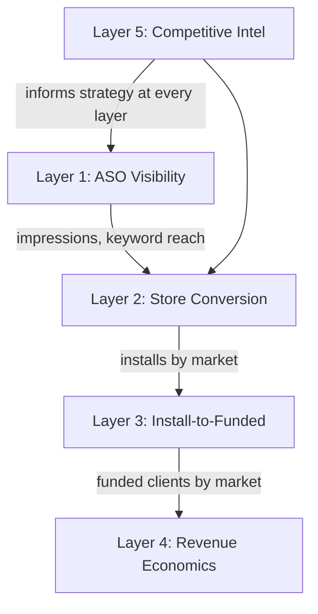

# Dashboard Expansion: Ranking to Revenue

> **Goal**: Expand the ASO dashboard from a single ranking tracker into a full-funnel decision tool that connects store visibility to funded-client acquisition economics, enabling data-driven market prioritisation.

---

## What exists today

The dashboard currently tracks **one metric** (category ranking) across 10 markets, with change log annotations and AI recommendations. This answers "where do we rank?" but not "so what?" or "what should we do next?".

## What's missing: the full funnel

To reach #1 and acquire funded clients at positive ROI, the dashboard needs to connect five layers. Each layer is ordered by funnel stage, and each one builds on the data from the layer above.



---

## Layer 1 — Keyword Visibility

**Data source:** AppTweak

Category rank alone does not explain *why* Deriv appears or does not appear. Keyword rankings are the engine behind category rank.

| Component | Description |
|-----------|-------------|
| Keyword rank table per market | Track 10–20 target keywords per country (e.g. "forex trading", "online trading Nigeria", "binary options"). Show current rank, 7d/30d trend, search volume estimate. |
| Search visibility score | Single composite number per market (sum of keyword positions weighted by volume). Track over time alongside category rank to see which is moving first. |
| Keyword gap analysis | For each market, show keywords where Deriv ranks but not in top 10, versus keywords where Deriv has no presence. These are the immediate opportunity list. |

**Why it matters**: You cannot reach #1 in category without dominating the top 5–10 keywords per market. This tells you exactly which keywords to optimise next.

---

## Layer 2 — Store Listing Conversion

**Data source:** Google Play Console

Ranking gets you impressions. Conversion turns impressions into installs.

| Component | Description |
|-----------|-------------|
| Funnel chart per market | Impressions → Store listing visitors → Installs → Install rate (CVR %) |
| CVR trend over time | Overlay CVR on the ranking timeline so you can see whether a rank improvement actually translated to more installs. |
| A/B test results panel | For active experiments (Kenya translated copy, Brazil PT-BR), show variant-level CVR, statistical significance progress bar, estimated days to significance. |
| Rating and review tracker | Average rating per market over time, review volume, sentiment breakdown. Rating directly affects both ranking and CVR. |

**Why it matters**: A market at rank #50 with 8% CVR acquires more users than a market at rank #20 with 2% CVR. Optimising conversion can be faster than climbing rankings.

---

## Layer 3 — Install to Funded Client

**Data source:** AppsFlyer

This is where ASO connects to business outcomes. Most ASO dashboards stop at installs. This one should not.

| Component | Description |
|-----------|-------------|
| Conversion waterfall per market | Installs → Registrations → KYC completed → First deposit (funded) → Active trader. Show drop-off % at each stage. |
| Time to fund | Median days from install to first deposit, by market. Markets with faster funding cycles deserve more ASO investment. |
| Funded client volume by source | Split organic (ASO-driven) vs paid installs so you can attribute funded clients to ASO efforts specifically. |
| Deposit quality | Average first deposit value by market, plus 30-day cumulative deposit value. Filters out markets that fund with minimum amounts and never trade. |

**Why it matters**: If Nigeria converts 4x better from install to funded client than Kenya, it should get 4x the ASO investment — even if Kenya ranks higher.

---

## Layer 4 — Revenue Economics

**Data source:** AppsFlyer

The ultimate scorecard: does ASO spend generate more revenue than it costs?

| Component | Description |
|-----------|-------------|
| Unit economics cards per market | CPI (cost per install), CPA (cost per funded client), LTV (lifetime value at 90/180/365 days), LTV:CAC ratio. |
| LTV:CAC ratio chart | Horizontal bar chart, one bar per market, sorted by ratio. Green above 3:1, amber 1–3:1, red below 1:1. The single most important chart for budget allocation. |
| ROI per initiative | Connect each change log initiative to its downstream economics. E.g. "Nigeria metadata localisation → 17 rank positions → +X installs → Y funded clients → $Z revenue at current LTV". |
| Payback period | For each market, how many days until a funded client has generated enough revenue to cover the acquisition cost. Shorter payback = safer to scale. |

**Why it matters**: This is the answer to "should we spend more on ASO?". If LTV:CAC is 5:1 in Nigeria but 0.8:1 in South Africa, the strategic answer is obvious regardless of ranking.

---

## Layer 5 — Competitive Intelligence

**Data source:** AppTweak

You cannot plan to be #1 without knowing who is #1 and why.

| Component | Description |
|-----------|-------------|
| Competitor rank table | For each market, show the top 5 apps in Finance category with their name, rating, install count, and recent rank movement. |
| Competitor metadata comparison | Side-by-side comparison of Deriv's title, short description, and screenshot strategy vs the #1 app in each market. |
| Gap-to-leader metric | Instead of "gap to #1" (an abstract number), show "gap to [specific app name]" with their rank trajectory. If the leader is declining, the gap is closing faster than it looks. |

**Why it matters**: Knowing the competitor's weakness is as valuable as knowing your own strength. If the #1 app in Nigeria has a 3.2 rating and no local payment mentions, that is an exploitable gap.

---

## Data Sources

| Layer | Tool | What to export |
|-------|------|----------------|
| Layer 1 (Keywords) | **AppTweak** | Keyword rankings by country, search volume, keyword suggestions |
| Layer 2 (Conversion) | **Google Play Console** | Store listing acquisition reports (impressions, visitors, installs, CVR) |
| Layer 3 (Funded clients) | **AppsFlyer** | In-app event data (registration, KYC, first deposit, deposit value) |
| Layer 4 (Economics) | **AppsFlyer** | Cost data, cohort LTV, CPI, CPA, retention |
| Layer 5 (Competitors) | **AppTweak** | Competitor rankings, ratings, download estimates, metadata |

---

## Data Structure (for dashboard integration)

Each layer maps to a JS data array in the dashboard. These are the schemas to populate from real exports:

```
KEYWORD_DATA     (AppTweak)       → { market, keyword, rank, prevRank, volume, difficulty }
FUNNEL_DATA      (Play Console)   → { market, date, impressions, visitors, installs, cvr }
ACQUISITION_DATA (AppsFlyer)      → { market, installs, registrations, kyc, funded, avgFirstDeposit, medianDaysToFund }
ECONOMICS_DATA   (AppsFlyer)      → { market, cpi, cpa, ltv90, ltv365, mktSpend, revenue }
COMPETITOR_DATA  (AppTweak)       → { market, app, rank, rating, installs, trend }
```

---

## Suggested Build Priority

| Priority | Layer | Effort | Impact | Rationale |
|----------|-------|--------|--------|-----------|
| 1 | Layer 2 (Store Conversion) | Low | High | Play Console data is free and already available. Doubles insight from existing ranking data. |
| 2 | Layer 3 (Install to Funded) | Medium | Highest | Connects ASO to revenue. The most valuable addition. |
| 3 | Layer 1 (Keyword Visibility) | Medium | High | Directly actionable for ASO execution. |
| 4 | Layer 4 (Revenue Economics) | Medium | High (strategic) | Most impactful for budget conversations and executive reporting. |
| 5 | Layer 5 (Competitive Intel) | Higher | Moderate | Useful but can be done manually in the short term. |

---

## Implementation Approach

Build all five layers with **realistic placeholder data** that mirrors the structure of real exports from each tool. Each layer gets its own clearly-commented JS data array in the dashboard. When real CSVs are available from AppTweak, Play Console, or AppsFlyer, swap the placeholder arrays with real values — no structural changes needed.
